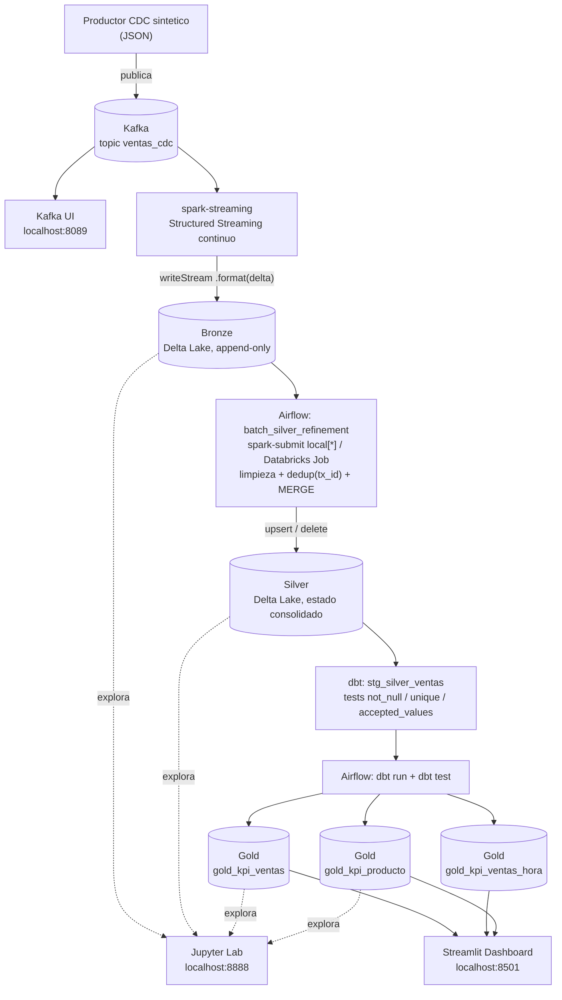

# lakehouse-docker-lab

Laboratorio reproducible de Ingeniería de Datos con arquitectura **Medallion
(Bronze → Silver → Gold)**, integrando **Apache Kafka**, **Apache Spark +
Delta Lake**, **dbt** y **Apache Airflow**.

Todo el stack es **open source y corre local con `docker compose`**, sin
depender de ninguna nube — la idea es mostrar cómo se arma un stack de datos
moderno con herramientas gratuitas, sin necesitar una cuenta de Azure ni de
Databricks para aprenderlo. El mismo código, además, se puede reapuntar a un
workspace real de Databricks cambiando solo variables de entorno (ver "Modo 2"
más abajo) — así se ve tanto la versión 100% local como la versión cloud
sin mantener dos proyectos distintos.

## El caso

Una cadena de retail vende productos de tecnología (notebooks, monitores,
sillas ergonómicas, etc.) y quiere dejar de mirar sus ventas una vez por mes
en una planilla, para tener métricas confiables — ingresos, unidades, ticket
promedio — por día, por hora y por producto, casi en tiempo real.

El problema no es solo "sumar ventas a medida que entran": el sistema de
origen genera correcciones todo el tiempo (una venta se anula, un precio se
corrige). Entonces no alcanza con ir *agregando* datos — hay que poder
aplicar esos cambios (`UPDATE`/`DELETE`) sobre datos que ya están guardados.
Ese patrón se llama **Change Data Capture (CDC)**, y es la razón real detrás
de casi todas las decisiones de arquitectura de este laboratorio (por qué
Kafka, por qué Delta Lake y no Parquet plano, por qué el batch de Silver hace
un `MERGE` en vez de un simple `INSERT`).

Este repo simula ese escenario de punta a punta: desde que se genera una
venta (o se corrige una ya existente) hasta que aparece como un KPI en un
dashboard.

## ¿Por qué este stack? (pieza por pieza)

Ningún componente está de adorno — cada uno resuelve un problema puntual del
caso de arriba:

| Pieza | Qué problema resuelve |
|---|---|
| **Apache Kafka** | Las ventas llegan de a una, todo el tiempo, y a veces más rápido de lo que el resto del sistema puede procesarlas. Kafka actúa de "colchón" entre quien genera los eventos y quien los procesa, sin perder ninguno aunque algo se caiga y reinicie. |
| **Kafka UI** | Poder mirar "adentro" de Kafka (tópicos, mensajes, consumers) sin usar la consola — para enseñar o depurar más cómodo. |
| **Apache Spark (Structured Streaming)** | Alguien tiene que estar escuchando Kafka 24/7 y guardando lo que llega. Spark Streaming lee el tópico en continuo y lo persiste solo, sin intervención manual. |
| **Delta Lake** | Guardar en Parquet plano no alcanza para CDC: hace falta poder aplicar `UPDATE`/`DELETE` sobre datos ya escritos, con garantías tipo base de datos (ACID) y viendo el historial de cambios. Delta Lake es lo que habilita el `MERGE INTO`. |
| **Apache Airflow** | Alguien tiene que decidir *cuándo* correr la limpieza de Silver y el modelado de Gold, en qué orden, y reintentar si algo falla. Airflow orquesta eso con un cronograma. |
| **dbt** | Transformar Silver en métricas de negocio (Gold) con SQL simple, versionado, testeado y documentado — en vez de scripts sueltos de los que nadie sabe si siguen funcionando. |
| **Jupyter Lab** | Explorar los datos crudos como en un notebook de Databricks, para entender qué hay en cada capa antes de confiar en un KPI. |
| **Streamlit** | El resultado final tiene que llegar a alguien que no sabe SQL: un dashboard con métricas y gráficos, sin instalar nada. |

## Arquitectura



## Estructura de archivos

```text
lakehouse-docker-lab/
├── docker-compose.yml
├── .env.example
├── airflow/
│   ├── Dockerfile
│   ├── requirements.txt
│   └── dags/dag_medallion_pipeline.py
├── producer/
│   ├── Dockerfile
│   ├── requirements.txt
│   └── cdc_producer.py
├── spark/
│   ├── Dockerfile
│   ├── conf/spark-defaults.conf
│   └── jobs/
│       ├── stream_kafka_to_bronze.py
│       ├── batch_bronze_to_silver.py
│       └── inspect_delta.py
├── dbt_project/
│   ├── dbt_project.yml
│   ├── profiles.yml
│   └── models/
│       ├── staging/{schema.yml, stg_bronze_ventas.sql, stg_silver_ventas.sql}
│       └── gold/{schema.yml, gold_kpi_ventas.sql, gold_kpi_ventas_hora.sql, gold_kpi_producto.sql}
├── jupyter/                    # Jupyter Lab (PySpark+Delta) para explorar Bronze/Silver/Gold
│   ├── Dockerfile
│   └── requirements.txt
├── notebooks/explorar_medallion.ipynb
├── dashboard/                  # Streamlit: dashboard de KPIs sobre la capa Gold
│   ├── Dockerfile
│   ├── requirements.txt
│   └── app.py
├── scripts/
│   ├── deploy_to_databricks.sh
│   └── upload_gold_to_azure.sh
└── data_lakehouse/            # volumen compartido: bronze/, silver/, gold/, checkpoints/
```

---

## Modo 1 — Todo local con Docker Compose (por defecto)

Emula Databricks: Spark corre en contenedores propios (`local[*]`) con Delta
Lake, sin necesidad de cuenta cloud.

### Prerrequisitos
- Docker + Docker Compose v2 (Docker Desktop recomendado, ≥6 GB RAM asignados)
- Puertos libres: `8080` (Airflow), `8089` (Kafka UI), `8888` (Jupyter),
  `8501` (Dashboard), `9094` (Kafka host), `5432` (Postgres, interno)

### Puesta en marcha

```bash
cd lakehouse-docker-lab
cp .env.example .env          # ajustar si hace falta (por defecto EXECUTION_MODE=local)
docker compose build
docker compose up -d
```

Primer arranque: `airflow-init` corre `airflow db migrate` y crea el usuario
`admin/admin` (o lo que definas en `.env`). Los servicios `producer` y
`spark-streaming` arrancan solos y quedan escribiendo continuamente en Bronze.

### Verificar la ingesta continua

**Kafka UI** (http://localhost:8089): navegador con el tópico `ventas_cdc` —
mensajes en vivo (con su JSON), particiones, offsets, throughput y consumer
groups (vas a ver al `spark-streaming` consumiendo). Mucho más cómodo que la
consola para mostrar en clase qué está pasando adentro de Kafka.

También por CLI si hace falta:

```bash
# Ver eventos crudos publicados en Kafka
docker compose exec kafka kafka-console-consumer \
  --bootstrap-server localhost:9092 --topic ventas_cdc --from-beginning --max-messages 5

# Ver que Bronze se está poblando
docker compose logs -f spark-streaming
ls -R data_lakehouse/bronze/ventas
```

### Disparar la refinación Silver y dbt (Gold)

Abrí Airflow en http://localhost:8080 (usuario/clave de `.env`), activá el DAG
`dag_medallion_pipeline` (corre cada 15 min, o disparalo manualmente con el
botón ▶). El DAG:

1. `batch_silver_refinement` → `spark-submit` del script batch (limpieza,
   dedup por `tx_id`, `MERGE INTO` con semántica CDC INSERT/UPDATE/DELETE).
2. `dbt_run` → construye las vistas de staging y las tablas Gold
   (`gold_kpi_ventas`, `gold_kpi_ventas_hora`, `gold_kpi_producto`).
3. `dbt_test` → corre los 21 tests de calidad (`not_null`, `unique`,
   `accepted_values`) definidos en `dbt_project/models/*/schema.yml`.

También podés correr todo manualmente sin Airflow, por ejemplo:

```bash
docker compose run --rm spark-streaming \
  spark-submit --packages io.delta:delta-spark_2.12:3.2.0 \
  --master local[*] /opt/spark/jobs/batch_bronze_to_silver.py

# Nota: se antepone el PATH del venv porque spark-submit/dbt resuelven
# "python3" internamente vía PATH, no alcanza con invocarlos por ruta absoluta.
docker compose exec airflow-scheduler bash -c \
  'export PATH="/home/airflow/spark_venv/bin:$PATH" && cd /opt/airflow/dbt_project && dbt run --profiles-dir . && dbt test --profiles-dir .'
```

### Ver los datos (Bronze / Silver / Gold)

**Opción 1 — Jupyter Lab** (http://localhost:8888, sin token): abrí
`notebooks/explorar_medallion.ipynb`. Ya viene con celdas listas para leer
Bronze, Silver (incluyendo `DESCRIBE HISTORY` para ver los `MERGE` de CDC en
acción) y las tres tablas Gold (diaria, por hora y por producto), con
gráficos de `matplotlib`, más una celda bonus que espía el tópico de Kafka en
crudo. Corre PySpark + Delta local, sin tocar Airflow.

**Opción 2 — Dashboard de KPIs** (http://localhost:8501): un dashboard
Streamlit que lee `gold_kpi_ventas`, `gold_kpi_ventas_hora` y
`gold_kpi_producto` directo del disco con la librería `deltalake` (delta-rs,
sin JVM) y muestra métricas, la evolución de ingresos por hora y rankings de
producto. Se refresca solo cada ~30s (botón "Actualizar ahora" en la barra
lateral para forzarlo) a medida que Airflow corre `dbt run`. Si todavía no
corriste el DAG una vez, va a avisar que las tablas no existen.

**Opción 3 — línea de comandos** (para depurar puntualmente, sin abrir nada):

```bash
# Bronze/Silver: rutas Delta "crudas", con el script spark/jobs/inspect_delta.py
docker compose exec airflow-scheduler bash -c \
  'export PATH="/home/airflow/spark_venv/bin:$PATH" && \
   spark-submit --packages io.delta:delta-spark_2.12:3.2.0 \
   /opt/spark_jobs/inspect_delta.py /opt/data_lakehouse/silver/ventas 20'

# Gold: tablas del metastore local que crea dbt -> dbt show
docker compose exec airflow-scheduler bash -c \
  'export PATH="/home/airflow/spark_venv/bin:$PATH" && cd /opt/airflow/dbt_project && \
   dbt show --select gold_kpi_ventas --profiles-dir . --limit 20'
```

(Las tablas Gold viven físicamente en `dbt_project/spark-warehouse/` en
formato Delta, junto a un metastore Derby (`dbt_project/metastore_db/`) que
dbt crea la primera vez que corre en modo local — se puede borrar sin
problema, se regenera solo. Por eso Jupyter y el dashboard pueden leer esas
mismas rutas directamente, sin pasar por dbt ni por Airflow.)

### Apagar / limpiar

```bash
docker compose down            # detiene todo, conserva el volumen data_lakehouse/
docker compose down -v         # además borra Postgres/Airflow y el cache de Ivy
rm -rf data_lakehouse/bronze/* data_lakehouse/silver/* data_lakehouse/gold/* data_lakehouse/checkpoints/*
```

---

## Modo 2 — Airflow y dbt contra un workspace real de Azure Databricks

Este modo reutiliza el **mismo repo**: Kafka + producer siguen corriendo en
Docker para generar el feed CDC, pero el cómputo Spark (refinación Silver) y
el modelado Gold (dbt) se ejecutan en Databricks.

### 1. Datos del workspace

En `.env` (o exportadas en el shell antes de `docker compose up`):

```bash
EXECUTION_MODE=databricks
DBT_TARGET=databricks

DATABRICKS_HOST=adb-xxxxxxxxxxxxxxxx.xx.azuredatabricks.net   # sin "https://"
DATABRICKS_HTTP_PATH=/sql/1.0/warehouses/xxxxxxxxxxxxxxxx      # SQL Warehouse para dbt
DATABRICKS_TOKEN=dapiXXXXXXXXXXXXXXXXXXXXXXXXXXXXXXXX          # Personal Access Token
DATABRICKS_CATALOG=hive_metastore                               # o tu catálogo Unity Catalog
DATABRICKS_SCHEMA=gold

DATABRICKS_SPARK_VERSION=15.4.x-scala2.12   # runtime del cluster efímero del job de Silver
DATABRICKS_NODE_TYPE=Standard_DS3_v2        # tipo de nodo Azure
DATABRICKS_NUM_WORKERS=1

# Conexión de Airflow hacia Databricks (formato URI):
AIRFLOW_CONN_DATABRICKS_DEFAULT=databricks://:dapiXXXXXXXXXXXXXXXXXXXXXXXXXXXXXXXX@adb-xxxxxxxxxxxxxxxx.xx.azuredatabricks.net

# La relación que leen los modelos Gold pasa a ser una tabla real (Unity Catalog / Hive metastore),
# no una ruta Delta local:
DBT_SILVER_RELATION=main.silver.ventas
```

> El PAT (Personal Access Token) se genera en Databricks: *User Settings →
> Developer → Access tokens*. El `http_path` de un SQL Warehouse se obtiene en
> *SQL Warehouses → tu warehouse → Connection details*.

### 2. Adaptar dónde escribe la refinación Silver

Como Silver ahora se calcula **dentro** de Databricks, `batch_bronze_to_silver.py`
debe leer/escribir contra rutas del workspace (DBFS, ADLS montado, o mejor,
tablas Unity Catalog) en lugar del volumen local `data_lakehouse/`. Ajustá
`LAKEHOUSE_PATH` (o reescribí `BRONZE_PATH`/`SILVER_PATH` en el script) a algo
como `abfss://lakehouse@<storage>.dfs.core.windows.net/...` o `dbfs:/lakehouse/...`,
y registrá la tabla resultante para que `DBT_SILVER_RELATION` pueda apuntarle
por nombre (`catalogo.schema.tabla`).

### 3. Subir los jobs de Spark al workspace

```bash
pip install databricks-cli
databricks configure --token   # host + token del paso 1
./scripts/deploy_to_databricks.sh
```

Esto copia `spark/jobs/*.py` a `dbfs:/lakehouse/jobs/`, que es lo que referencia
`DatabricksSubmitRunOperator` en el DAG cuando `EXECUTION_MODE=databricks`.

### 4. Levantar el stack

```bash
docker compose up -d --build
```

Con `EXECUTION_MODE=databricks`, el DAG (`airflow/dags/dag_medallion_pipeline.py`)
reemplaza automáticamente el `spark-submit` local por un
`DatabricksSubmitRunOperator` que crea un cluster efímero y corre
`batch_bronze_to_silver.py` en Databricks; y `dbt` (vía `dbt-databricks`) corre
contra el SQL Warehouse indicado en `DATABRICKS_HTTP_PATH`.

> Nota: en este modo los contenedores `spark-streaming` (ingesta continua
> local) quedan corriendo pero son redundantes si la ingesta real ocurre en un
> Databricks Job/DLT aparte; podés detenerlos con
> `docker compose stop spark-streaming` si el streaming Kafka→Bronze también
> se implementa como un job nativo de Databricks.

---

## Extra — Ver Gold en Power BI, vía Azure Storage

No hace falta Databricks para esto: alcanza con subir la carpeta física de la
tabla Gold (parquet + `_delta_log`) a un Storage Account de Azure y leerla
desde Power BI como una tabla Delta Lake. Power BI Desktop solo existe para
Windows; si no tenés Windows a mano, se puede armar todo igual desde
**Power BI Service** (app.powerbi.com, en el navegador) usando un *Dataflow*,
que incluye el mismo editor Power Query.

### 1. Crear el storage y subir la tabla

Necesitás un Storage Account (Blob o Data Lake Gen2, ambos sirven) con un
contenedor, y un SAS token con permiso de escritura sobre ese contenedor
(Portal de Azure → tu Storage Account → el contenedor → "Generate SAS").

```bash
# Instalar azcopy si no lo tenés (instrucciones por SO):
# https://learn.microsoft.com/azure/storage/common/storage-use-azcopy-v10

AZURE_CONTAINER_SAS_URL='https://<cuenta>.dfs.core.windows.net/<contenedor>?<sas-token>' \
  ./scripts/upload_gold_to_azure.sh all
```

Esto sube `gold_kpi_ventas/`, `gold_kpi_ventas_hora/` y `gold_kpi_producto/`
(con su `_delta_log/` completo — Power BI necesita esa carpeta para leer la
tabla como Delta, no solo los `.parquet`) a `<contenedor>/gold/<tabla>/`.

### 2. Leerla desde Power BI (Power Query M)

El conector nativo de "Azure Data Lake Storage Gen2" en Power BI **no**
navega subcarpetas — solo llega hasta el contenedor. Para leer Delta Lake
hay que usar la función M `Delta.Table`
([delta-io/delta/connectors/powerbi](https://github.com/delta-io/delta/blob/master/connectors/powerbi)):

1. Nueva consulta en blanco → **Editor avanzado**.
2. Pegá el código de `Delta.Table` del repo de arriba.
3. Abajo de todo, llamala apuntando a la tabla:

   ```
   Delta.Table(
       "https://<cuenta>.dfs.core.windows.net/<contenedor>/gold/gold_kpi_ventas",
       [HierarchicalNavigation = false]
   )
   ```

   (`HierarchicalNavigation = false` es necesario específicamente para ADLS
   Gen2; con Blob Storage a secas no hace falta.)
4. Repetí para `gold_kpi_producto` con otra consulta.

Esto funciona igual en Power BI Desktop (Windows) o en el editor de Power
Query de un Dataflow en Power BI Service (navegador, cualquier sistema
operativo).

> Esta carga es una foto: si corrés el DAG de nuevo y querés reflejar los
> datos nuevos en Power BI, volvé a correr `upload_gold_to_azure.sh` y
> refrescá el dataset/dataflow en Power BI.

---

## Detalles de diseño relevantes para la clase

- **CDC sintético**: `producer/cdc_producer.py` no solo inserta ventas nuevas;
  con probabilidad ~35% reutiliza un `tx_id` ya emitido para simular
  `UPDATE`/`DELETE`, para que el `MERGE INTO` de Silver tenga algo real que
  resolver.
- **Exactly-once en streaming**: `stream_kafka_to_bronze.py` usa
  `checkpointLocation` sobre el volumen compartido, así un restart del
  contenedor no duplica ni pierde eventos.
- **Upsert/delete real con Delta Lake**: `batch_bronze_to_silver.py` usa
  `DeltaTable.merge()` con `whenMatchedDelete`, `whenMatchedUpdateAll` y
  `whenNotMatchedInsertAll`, la misma API que usarías en Databricks.
- **dbt sin depender de un metastore**: el target `local` de
  `dbt_project/profiles.yml` usa `method: session` (Spark embebido en el
  propio proceso de dbt/Airflow) y los modelos leen la Silver directamente
  por ruta (`delta.\`/opt/data_lakehouse/silver/ventas\``) vía la var
  `silver_ventas_relation`; en Databricks esa misma var apunta a una tabla de
  catálogo (`DBT_SILVER_RELATION`), sin tocar el SQL de los modelos.
- **Un único DAG para ambos modos**: `dag_medallion_pipeline.py` decide en
  tiempo de parseo (`EXECUTION_MODE`) si el paso de Silver es un
  `BashOperator` con `spark-submit local[*]` o un `DatabricksSubmitRunOperator`.
- **PySpark/dbt en un virtualenv aislado dentro de la imagen de Airflow**:
  `apache-airflow-providers-databricks` y `dbt-databricks` requieren versiones
  incompatibles de `databricks-sql-connector`, así que no pueden convivir en
  el mismo entorno de pip. Por eso `airflow/Dockerfile` crea
  `/home/airflow/spark_venv` (pyspark, delta-spark, dbt-core, dbt-spark,
  dbt-databricks) separado del entorno principal de Airflow, y el DAG invoca
  `spark-submit`/`dbt` por ruta absoluta a ese venv.
- **Dos formas distintas de leer Delta, a propósito**: Jupyter usa PySpark
  (motor completo, útil para explorar/transformar Bronze y Silver como lo
  harías en un notebook de Databricks), mientras que el dashboard de
  Streamlit usa `deltalake` (delta-rs): lee los Parquet + `_delta_log` de
  Gold directo en Python/Rust, sin JVM ni SparkSession, ideal para una app
  liviana de solo lectura.
- **Capa de staging + severidad de tests distinta por capa**: `stg_silver_ventas`
  y `stg_bronze_ventas` (`models/staging/`) son vistas livianas que existen
  para poder colgarles tests de calidad con la sintaxis normal de dbt. Sobre
  Silver los tests son `error` (el default): si fallan, cortan el pipeline,
  porque asumen que el batch de limpieza ya garantizó esas condiciones.
  Sobre Bronze son `severity: warn` a propósito — Bronze es una captura cruda
  por diseño (esa es la idea del medallion), así que ahí solo queremos
  *monitorear* la calidad del feed de origen, no bloquear nada.
- **`gold_kpi_ventas` (diario) vs. `gold_kpi_ventas_hora`**: se agregó el
  segundo porque, corriendo el lab en una sola sesión de clase, el grano
  diario da un único punto y no sirve para graficar nada — el de hora sí
  muestra evolución real y es el que usa el dashboard.

## Troubleshooting

- **Airflow tarda en healthy / puerto 8080 ocupado**: cambiar el mapeo de
  puertos en `docker-compose.yml` (`airflow-webserver.ports`).
- **`spark-submit` descarga paquetes Maven en cada corrida**: normal la
  primera vez; quedan cacheados en el volumen `spark-ivy-cache`.
- **dbt `session` falla por memoria**: bajar `spark.driver.memory` en
  `spark/conf/spark-defaults.conf` o asignar más RAM a Docker Desktop.
- **`dbt-databricks` rechaza el host**: `DATABRICKS_HOST` no debe incluir el
  prefijo `https://`.
